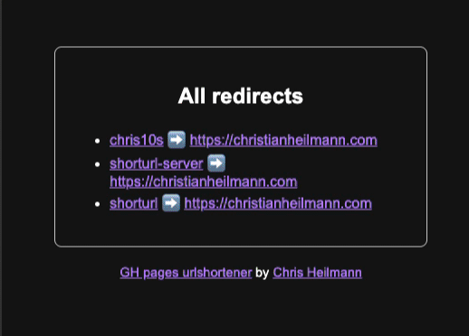
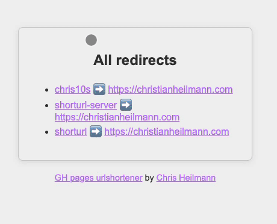

# gh-pages-urlshortener

This repository has all the settings to turn your GitHub Pages into a URL shortener. 
Of course you shouldn't keep the original `.github.io` domain, but [link your custom one](https://docs.github.com/en/enterprise-cloud@latest/pages/configuring-a-custom-domain-for-your-github-pages-site/managing-a-custom-domain-for-your-github-pages-site?apiversion=2022-11-28) to really provide shorter links.

You can [try out the experience here](https://codepo8.github.io/gh-pages-urlshortener/go/chris10s.html). 

## Setting up your redirects

All the links you want to redirect are in the `_go` folder. You need to create one markdown file for each redirection. 

### Immediate redirect

If all you want to do is to redirect without any information, create a file with the following markdown:

```markdown
---
goto: https://christianheilmann.com
redirect_to:
  - https://christianheilmann.com
---
```

You can see this in the `shorturl-server.md` example in the `_go` folder.

### Redirect with page viewing 

If you want to immediately redirect but show a page, you can do the following:

```markdown
---
goto: https://christianheilmann.com
layout: redirect
---
```
You can see this in the `shorturl.md` example in the `_go` folder.

### Delayed and cancelable the redirect

If you check the `chris10s.md` example in the `_go` folder you can see how you can allow for 10 seconds to see and cancel the redirect:

```markdown
---
goto: https://christianheilmann.com
layout: redirect
delay: 10
---
```

This results in the following experience:



Users can also choose to cancel the redirect (this time showing the light mode):



## Customising the experience

If you want a different url than `yourdomain/go/short` you need to rename the `_go` folder to something else, and change the setting in the `_config.yml` file. 

```yaml
collections:
  go:
    output: true
```

So if you want to have `yourdomain/hitherto/short`, this would be:

```yaml
collections:
  hitherto:
    output: true
```

### Changing the look and feel

The `_layouts` folder has both the template for the index page as well as the redirection interface. CSS and JS are in the documents as I didn't want to cause any delays when redirecting.


